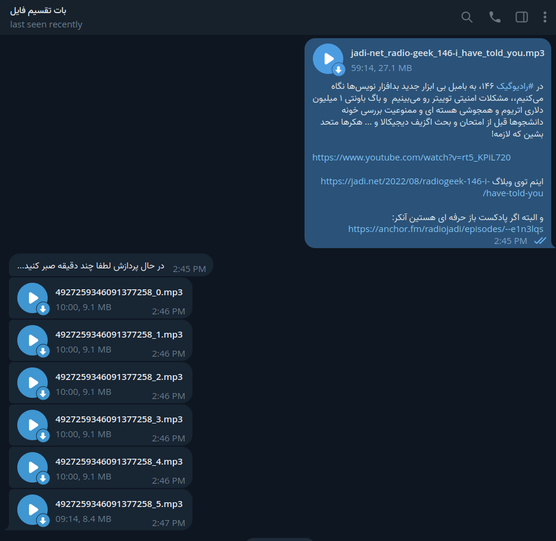

# Voice-Split-Bot
This is a telegram userbot with telethon and AudioSegment libraries designed to efficiently split lengthy audio files into convenient 10-minute segments.

## Prerequisites
You'll need:

* install requirements.txt
* get api_id and api_hash from my.Telegram.org and place it in config.py

  

